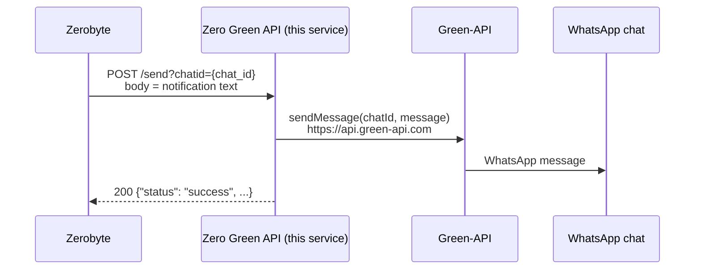

# Zerobyte WhatsApp Notification Service (Zero Green API)

A small FastAPI service that receives notifications from [Zerobyte](https://github.com/nicotsx/zerobyte) and forwards them to a WhatsApp contact or group through [Green-API](https://green-api.com/en). Zerobyte has no built-in WhatsApp destination. This service fills the gap: Zerobyte POSTs the plain notification text to it, and it sends that text as a WhatsApp message.

Inside the code the service calls itself **Zero Green API**. That is the FastAPI title, and the `GET /` endpoint returns it too.

> **Disclaimer:** This is an unofficial, community project. It is not affiliated with, endorsed by, or sponsored by WhatsApp/Meta, Green-API, or Zerobyte.

## Table of contents

- [Features](#features)
- [How it works](#how-it-works)
- [Requirements](#requirements)
- [Green-API setup](#green-api-setup)
- [Installation](#installation)
- [Configuration](#configuration)
- [Configuring Zerobyte](#configuring-zerobyte)
- [API reference](#api-reference)
- [Message format](#message-format)
- [Troubleshooting](#troubleshooting)
- [Security notes](#security-notes)
- [Development](#development)
- [Contributing](#contributing)
- [License](#license)

## Features

- **Zerobyte → WhatsApp bridge**: turns a Zerobyte notification (plain text body) into a WhatsApp message.
- **Any chat**: the target contact (`…@c.us`) or group (`…@g.us`) is chosen per request with the `chatid` query parameter, so one instance can serve several Zerobyte destinations.
- **Green-API delivery**: messages are sent with Green-API's `sendMessage` method through the official [`whatsapp-chatbot-python`](https://github.com/green-api/whatsapp-chatbot-python) library.
- **Health endpoints**: `GET /` and `GET /health` for simple liveness checks.
- **Container image**: multi-arch Docker image (`linux/amd64`, `linux/arm64`) on Docker Hub, based on `python:3.11-slim`.
- **Logging**: delivery successes and failures are logged with [Loguru](https://github.com/Delgan/loguru).

## How it works



1. Zerobyte sends a backup event (start, success, warning or failure) to a notification destination. That destination points at this service's `/send` endpoint.
2. The service reads the raw request body as UTF-8 text and takes the chat ID from the `chatid` query parameter.
3. It calls Green-API `sendMessage` with that chat ID and text. The library uses the default Green-API host, `https://api.green-api.com`.
4. It answers `200` with a JSON summary. Delivery errors are only logged (see [Troubleshooting](#troubleshooting)).

Project layout:

```
.
├── app/
│   ├── app.py          # Entry point: starts the server on 0.0.0.0:80
│   ├── server.py       # FastAPI app and routes (/, /health, /send)
│   └── proxy.py        # Green-API client (reads ID_INSTANCE / TOKEN, sends messages)
├── screenshots/        # README images
├── .github/workflows/  # Docker Hub and GHCR publishing workflows (manual)
├── Dockerfile
├── docker-compose.yaml
└── requirements.txt
```

## Requirements

- A **Green-API account** with an authorized instance. You need its **Instance ID** (`idInstance`) and **API token** (`apiTokenInstance`).
- A running **Zerobyte** instance that can reach this service over the network.
- To run it: **Docker** (and optionally Docker Compose), or **Python 3.11** for a local run.

## Green-API setup

1. Create an account at [green-api.com](https://green-api.com/en) and create an instance in the console.
2. Authorize the instance by scanning the QR code with the WhatsApp account that should send the notifications.
3. Copy the instance's **idInstance** and **apiTokenInstance**. They become `ID_INSTANCE` and `TOKEN`.
4. Work out the chat ID of the recipient:
   - **Contact**: the phone number in international format, digits only (no `+`, spaces or dashes), followed by `@c.us`. For example `<phone_number>@c.us`.
   - **Group**: the group ID followed by `@g.us`. You can find it with Green-API's `getContacts` or `getChats` methods, or in the console.

   The service passes `chatid` to Green-API exactly as given. It does **not** add `@c.us` for you, so always include the suffix.

> **Note:** The Green-API host is not configurable. The service always uses the library default, `https://api.green-api.com`. <!-- TODO: verify whether instances that the console assigns to a dedicated cluster host (e.g. `https://7103.api.greenapi.com`) still work through the default host -->

> **Heads-up: startup side effects on the Green-API instance.** On startup the service creates a `GreenAPIBot` from the `whatsapp-chatbot-python` library. With the library's defaults, the constructor:
> - reads the instance settings and, if incoming and outgoing message webhooks are all off, turns them **on**;
> - drains and **deletes all queued incoming notifications** on the instance.
>
> Keep this in mind if the same Green-API instance is shared with another bot or integration. <!-- TODO: verify — whatsapp_chatbot_python is unpinned in requirements.txt, so this depends on the installed version -->

## Installation

The published image is `techblog/zerobyte-whatsapp-notification-proxy` on Docker Hub. The container listens on port **80**.

### Docker Compose

The repository's `docker-compose.yaml`:

```yaml
services:
  zero-green:
    image: techblog/zerobyte-whatsapp-notification-proxy
    container_name: zero-green
    ports:
      - "8000:80"
    restart: unless-stopped
    environment:
      - PYTHONUNBUFFERED=1
      - ID_INSTANCE=
      - TOKEN=
```

1. Fill in `ID_INSTANCE` and `TOKEN` with your Green-API credentials (or use an `.env` file and `ID_INSTANCE=${ID_INSTANCE}`).
2. Start it:

   ```bash
   docker compose up -d
   ```

3. Check it: `curl http://localhost:8000/health` should return `{"status":"healthy"}`.

The service is then reachable on host port **8000**.

### Docker run

```bash
docker run -d \
  --name zero-green \
  --restart unless-stopped \
  -p 8000:80 \
  -e ID_INSTANCE=<your_instance_id> \
  -e TOKEN=<your_api_token> \
  techblog/zerobyte-whatsapp-notification-proxy:latest
```

### Build the image yourself

```bash
docker build -t zero-green .
docker run -d -p 8000:80 -e ID_INSTANCE=<your_instance_id> -e TOKEN=<your_api_token> --name zero-green zero-green
```

### From source

Requires Python 3.11 (the version used by the Docker image).

```bash
git clone https://github.com/t0mer/zerobyte-whatsapp-notification-service.git
cd zerobyte-whatsapp-notification-service
python -m venv .venv && . .venv/bin/activate
pip install -r requirements.txt

export ID_INSTANCE=<your_instance_id>
export TOKEN=<your_api_token>
python app/app.py
```

The server listens on `http://0.0.0.0:80`. Port 80 is a privileged port, so on Linux you may need extra rights to bind it (the port is hard-coded; see [Configuration](#configuration)).

## Configuration

All configuration comes from environment variables. There are no CLI flags and no config file.

| Variable | Required | Default | Description |
|----------|----------|---------|-------------|
| `ID_INSTANCE` | Yes | none | Green-API instance ID (`idInstance`). |
| `TOKEN` | Yes | none | Green-API instance API token (`apiTokenInstance`). |
| `PYTHONUNBUFFERED` | No | not set (set to `1` in `docker-compose.yaml`) | Standard Python setting. Optional and harmless here: all logging goes to stderr, which is line-buffered, so it doesn't change what appears in `docker logs`. |

**Port and host.** The listen address is hard-coded in `app/app.py` as `0.0.0.0:80`, and the Dockerfile `EXPOSE`s `80`. To use a different port, publish it differently (for example `-p 8000:80`), or change `app/app.py` and rebuild.

**Chat ID.** There is no default recipient. Every request must include a `chatid` query parameter.

## Configuring Zerobyte

Zerobyte sends notifications through [Shoutrrr](https://shoutrrr.nickfedor.com/latest/services/overview/). You can reach this service with either of two destination types. Both deliver the notification text as the plain request body, which is what `/send` expects.

In both cases, Zerobyte only sends to HTTP endpoints whose origin is listed in its **`WEBHOOK_ALLOWED_ORIGINS`** environment variable. Add this service's origin, for example `http://zero-green` or `https://notify.example.com`, and restart Zerobyte. Zerobyte normalizes default ports, so `http://zero-green:80` and `http://zero-green` match the same target.

**Which address to use.** The examples below use `zero-green:80` (container name, container port). That name only resolves if Zerobyte runs on the same user-defined Docker network as this container, and the repository's `docker-compose.yaml` doesn't define one, so you have to add a shared network yourself. Otherwise use the published host port, `http://<host>:8000`, and allowlist that origin (`http://<host>:8000`) in `WEBHOOK_ALLOWED_ORIGINS` instead.

### Option A: Generic Webhook (simplest)

1. In Zerobyte open **Notifications** → **Create Destination**.
2. **Type**: `Generic Webhook`.
3. **Webhook URL**: `http://<server_address>:<port>/send?chatid=<chat_id>`, for example `http://zero-green:80/send?chatid=<phone_number>@c.us` (shared Docker network) or `http://<host>:8000/send?chatid=<phone_number>@c.us`.
4. **Method**: `POST`. Leave **Use JSON Template** **off**, so the body is the plain notification text.
5. Save, open the destination, then press **Test**.

With an `http://` URL Zerobyte adds `disabletls=yes` for you, and other query parameters such as `chatid` are passed through.

### Option B: Custom (Shoutrrr URL)

1. In Zerobyte open **Notifications** → **Create Destination**.
2. Give it a name, for example `whatsapp`.
3. **Type**: `Custom (Shoutrrr URL)`.
4. **Shoutrrr URL**:

   ```text
   generic://<server_address>/send?chatid=<chat_id>
   ```

   - `<server_address>`: the host (and port if not default) of this service, **without** `http://` or `https://`, e.g. `zero-green:80` on a shared Docker network, or `<host>:8000` otherwise.
   - `<chat_id>`: the contact (`…@c.us`) or group (`…@g.us`) chat ID.
   - Shoutrrr's `generic://` service uses **HTTPS** by default. If the service is reached over plain HTTP (the default setup), add `&disabletls=yes`:

     ```text
     generic://zero-green:80/send?chatid=<chat_id>&disabletls=yes
     ```

5. Save, open the destination, then press **Test**.


### Route events

Destinations do nothing until they are assigned. Open a backup schedule, go to **Notifications** → **Add notification**, pick the destination, and choose the events (`start`, `success`, `warning`, `failure`) to send.

## API reference

The service has no authentication. FastAPI's automatic docs are also served at `/docs` (Swagger UI), `/redoc`, and `/openapi.json`.

### `GET /`

Status message.

```json
{ "message": "Zero Green API is running" }
```

### `GET /health`

Liveness check. It does not contact Green-API.

```json
{ "status": "healthy" }
```

### `POST /send?chatid=<chat_id>`

Sends the request body as a WhatsApp message.

| Part | Description |
|------|-------------|
| `chatid` (query, required) | Green-API chat ID, e.g. `<phone_number>@c.us` or `<group_id>@g.us`. Missing → `422`. |
| Body | Raw message text, decoded as UTF-8. The `Content-Type` header is ignored. |

Example (the `@` is URL-encoded as `%40` for safety):

```bash
curl -X POST "http://localhost:8000/send?chatid=<phone_number>%40c.us" \
  -H "Content-Type: text/plain" \
  --data-binary "Hello from Zero Green API!"
```

Response (`200`):

```json
{
  "status": "success",
  "chatid": "<phone_number>@c.us",
  "message": "Hello from Zero Green API!",
  "result": null
}
```

The endpoint echoes the message back and always reports `"status": "success"`, with `"result": null`. This happens **even if Green-API rejected the message**. Check the service logs to confirm delivery.

## Message format

The WhatsApp message is exactly the request body. Nothing is added, trimmed or reformatted.

With Zerobyte, that body is the notification **message text**: the event details such as volume, repository, schedule, and summary or error. Shoutrrr's generic service sends only the message in plain (non-JSON) mode, so the notification **title** is not part of the WhatsApp message. Don't enable **Use JSON Template** in Zerobyte. If you do, the raw JSON text is sent to WhatsApp as-is.

WhatsApp text formatting (`*bold*`, `_italic_`, and so on) in the body is rendered by WhatsApp as usual.

## Troubleshooting

| Symptom | Likely cause |
|---------|--------------|
| `/send` returns `success` but no WhatsApp message arrives | Green-API errors are only logged. Run `docker logs zero-green` and look for lines from the client library such as `Request was failed with status code: …` or `Request was failed with error: …`. The service still logs `Notification sent to <chat_id>` in that case, so that line does **not** confirm delivery. Common causes: wrong `ID_INSTANCE`/`TOKEN`, instance not authorized (QR not scanned), or a chat ID without `@c.us`/`@g.us`, or with a `+` or spaces. |
| `422 Unprocessable Entity` from `/send` | The `chatid` query parameter is missing. |
| Container exits or restarts right after start | The Green-API client contacts the instance at startup (see [Green-API setup](#green-api-setup)). With missing or wrong credentials, or no outbound access to `api.green-api.com`, startup fails with a `TypeError` raised in the library's `_update_settings`, and the container exits. |
| Zerobyte **Test** fails with an origin or "not allowed" error | Add the service origin to Zerobyte's `WEBHOOK_ALLOWED_ORIGINS`. |
| Custom Shoutrrr destination fails with a TLS or connection error | `generic://` defaults to HTTPS. Add `&disabletls=yes` for a plain-HTTP service, or use the Generic Webhook type with an `http://` URL. |
| WhatsApp shows JSON instead of text | **Use JSON Template** is enabled on the Zerobyte destination. Turn it off. |
| `500 Internal Server Error` on `/send` | The body is not valid UTF-8. |

## Security notes

- **No authentication on `/send`.** Anyone who can reach the service can send WhatsApp messages from your account to any chat. Don't expose it to the internet. Keep it on a private or Docker network that only Zerobyte can reach, or put it behind a reverse proxy that adds authentication and TLS.
- **Treat the Green-API token as a password.** Pass `ID_INSTANCE` and `TOKEN` through environment variables or an `.env` file that is not committed. Never put real values in `docker-compose.yaml` in a public repository.
- **Logs may contain credentials.** Every delivery is logged with the recipient chat ID. Failed connection attempts are logged with the Green-API request URL, which includes the instance ID and API token, so treat logs like the token itself. The `/send` response echoes the full message, so handle logs and responses as potentially sensitive.
- **Container user.** The Docker image runs as root (no `USER` directive). Run it with the least privileges your environment allows.

## Development

Run locally as described in [From source](#from-source). The dependencies are listed in `requirements.txt`: `fastapi`, `uvicorn[standard]` and `requests` are pinned, while `loguru` and `whatsapp_chatbot_python` are not.

There are no tests or linters in the repository.

### CI / published images

Both workflows are **manual** (`workflow_dispatch`) only.

| Workflow | File | Publishes | Platforms |
|----------|------|-----------|-----------|
| Docker Build | `.github/workflows/docker-image.yml` | `techblog/zerobyte-whatsapp-notification-proxy:latest` and `:<short commit SHA>`. The workflow tries `git describe --tags`, but its shallow checkout fetches no tags, so the tag is always the short commit SHA. | `linux/amd64`, `linux/arm64` |
| Publish to GHCR | `.github/workflows/publish-ghcr.yml` | `ghcr.io/t0mer/zerobyte-whatsapp-notification-proxy:latest` and `:<tag input>` (default `latest`) | `linux/amd64`, `linux/arm64`, `linux/arm/v7` |

Currently published:

- **Docker Hub**: `techblog/zerobyte-whatsapp-notification-proxy` with tags `latest`, `76198ac`, `b0c7346` and `42ebda5` (commit-SHA tags, since the repository has no git tags), for `linux/amd64` and `linux/arm64`.
- **GHCR**: nothing has been published yet (the GHCR workflow has not been run).
- There are no GitHub releases and no git tags.

## Contributing

Issues and pull requests are welcome at [t0mer/zerobyte-whatsapp-notification-service](https://github.com/t0mer/zerobyte-whatsapp-notification-service). Keep changes small and focused, and describe how you tested them (for example with the `curl` example above against a test Green-API instance).

## License

This repository has **no license file**. Until one is added, no license is granted to use, copy, or modify the code beyond what GitHub's terms allow.
